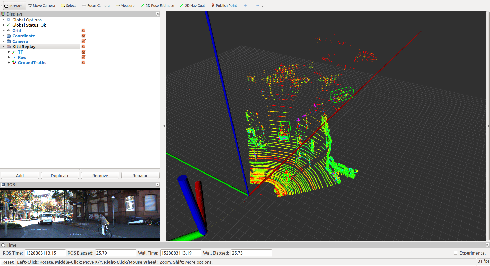

# kitti_ros
　　A ROS-based player to replay [KiTTI dataset](http://www.cvlibs.net/datasets/kitti/).
<p align="center">
    
</p>


## TODO list
- [x] Publish `*.bin` Point Cloud in topic **/kitti/points_raw** _(sensor_msgs/PointCloud2)_.
- [x] Publish ground truth in `tracklet_labels.xml`.
    - [x] Publish `care_objects`' 3D OBB (Oriented bounding box) in topic **/kitti/bb_raw** _(geometry_msgs/PoseArray)_.
    - [x] Publish as well as **/kitti/bb_marker** _(visualization_msgs/MarkerArray)_ for visualization.
- [x] Publish `*.png` Image in topic **/kitti/img_raw** _(sensor_msgs/Image)_.
    - [ ] Publish any Camera `0-3` image.
- [x] Publish `*.txt` Pose in tf between `imu_frame` and `world_frame`.
- [ ] Publish `*.txt` Calibration in tf between Coordinates.
- [x] KiTTI LiDAR-Camera Fusion, [kitti_lidar_camera](https://github.com/LidarPerception/kitti_lidar_camera)


## How to use
　We name your ros workspace as `CATKIN_WS` and `git clone` [kitti_ros](https://github.com/LidarPerception/kitti_ros) as a ros package.
```bash
# clone source code
$ cd $(CATKIN_WS)/src
$ git clone https://github.com/LidarPerception/kitti_ros
$ cd kitti_ros
# install python's dependencies
$ pip install -r requirements.txt 

# build your ros workspace
$ cd $(CATKIN_WS)
$ catkin build -DCMAKE_BUILD_TYPE=Release

# change Mode for Keyboard Listening Device
$ sudo chmod 777 /dev/input/event3

# [demo] launch kitti_ros's kitti_player with rviz
$ source devel/setup.bash
$ roslaunch kitti_ros demo.launch kitti_data_path:=path-to-your-KiTTI-dataset
```
　Learn more about parameter: `kitti_data_path` from [Here](#parameters). We recommend to use **quickstart** for KiTTI's LiDAR-perception algorithms testing and model training.
```bash
# copy quickstart bash scripts
$ cd $(CATKIN_WS)/src/kitti_ros
$ cp quickstart.sh killall.sh ../..

# quick start kitti_ros basic environment and visualization
$ cd $(CATKIN_WS)
$ ./quickstart.sh 

# [option 1] launch kitti_ros's kitti_player for frame-by-frame algorithm testing
$ roslaunch kitti_ros kitti_player.launch kitti_data_path:=path-to-your-KiTTI-dataset
# [option 2] launch kitti_ros's kitti_continue_player for data replay, like model training
$ roslaunch kitti_ros kitti_continue_player.launch dataset_file:=path-to-your-KiTTI-dataset-list-file

# quick exit
$ ./killall.sh
```
　Learn more about parameter: `dataset_file` from [Here](#parameters).

　**Keyboard Control**
+ `SPACE`: Play/Pause KiTTI data replay.
+ `LEFT ARROW`: Play last frame of data.
+ `RIGHT ARROW`: Play next frame of data.

## [Parameters](./launch/kitti_player.launch)
+ `keyboard_file`: Keyboard listener is based on Linux input subsystem.
+ `fps`: default `10`Hz, the same as LiDAR frequency.
+ `kitti_data_path`: KiTTI raw data directory.
    + default `$(find kitti_ros)/../../data/2011_09_26/2011_09_26_drive_0005_sync`, that is `$(CATKIN_WS)/data/2011_09_26/2011_09_26_drive_0005_sync`.
    ```yaml
    2011_09_26
    ├── 2011_09_26_drive_0005_sync
    │   ├── image_00
    │   │   ├── data
    │   │   │   ├── 0000000xxx.png
    │   │   │   ├── ...
    │   │   └── timestamps.txt
    │   ├── image_01
    │   │   ├── data
    │   │   │   ├── 0000000xxx.png
    │   │   │   └── ...
    │   │   └── timestamps.txt
    │   ├── image_02
    │   │   ├── data
    │   │   │   ├── 0000000xxx.png
    │   │   │   └── ...
    │   │   └── timestamps.txt
    │   ├── image_03
    │   │   ├── data
    │   │   │   ├── 0000000xxx.png
    │   │   │   └── ...
    │   │   └── timestamps.txt
    │   ├── oxts
    │   │   ├── data
    │   │   │   ├── 0000000xxx.txt
    │   │   │   └── ...
    │   │   ├── dataformat.txt
    │   │   └── timestamps.txt
    │   ├── tracklet_labels.xml
    │   └── velodyne_points
    │       ├── data
    │       │   ├── 0000000xxx.bin
    │       │   └── xxx
    │       ├── timestamps_end.txt
    │       ├── timestamps_start.txt
    │       └── timestamps.txt
    ├── 201?_??_??_drive_0???_sync
    │   ├── ...
    │   └── ...
    ├── calib_cam_to_cam.txt
    ├── calib_imu_to_velo.txt
    └── calib_velo_to_cam.txt
    ```
+ `dataset_file`: Only for **[kitti_continue_player](./launch/kitti_continue_player.launch)**, a list of `kitti_data_path` line after line.
    + default is `$(find kitti_ros)/../../data/training_datasets.txt`, as following:
    ```yaml
    #/home/gary/Workspace/intern_ws/catkin_ws/data/2011_09_26/2011_09_26_drive_0001_sync
    /home/gary/Workspace/intern_ws/catkin_ws/data/2011_09_26/2011_09_26_drive_0005_sync
    /home/gary/Workspace/intern_ws/catkin_ws/data/2011_09_26/2011_09_26_drive_0014_sync
    /home/gary/Workspace/intern_ws/catkin_ws/data/2011_09_26/2011_09_26_drive_0017_sync
    #/home/gary/Workspace/intern_ws/catkin_ws/data/2011_09_26/2011_09_26_drive_0018_sync
    #/home/gary/Workspace/intern_ws/catkin_ws/data/2011_09_26/2011_09_26_drive_0020_sync
    
    #GPF works bad in this dataset
    /home/gary/Workspace/intern_ws/catkin_ws/data/2011_09_26/2011_09_26_drive_0027_sync
    
    /home/gary/Workspace/intern_ws/catkin_ws/data/2011_09_26/2011_09_26_drive_0060_sync
    #/home/gary/Workspace/intern_ws/catkin_ws/data/2011_09_26/2011_09_26_drive_0091_sync
    
    #without ground truth
    #/home/gary/Workspace/intern_ws/catkin_ws/data/2011_09_26/2011_09_26_drive_0117_sync
    ```
+ `filter_by_camera_angle`: Only care about Camera's angle of view, default `true`.
+ `care_objects`: default `['Car','Van','Truck','Pedestrian','Sitter','Cyclist','Tram','Misc']`, `[]` means no forground objects.


## References
```bibtex
@article{geiger2013vision,
  title={Vision meets robotics: The KITTI dataset},
  author={Geiger, Andreas and Lenz, Philip and Stiller, Christoph and Urtasun, Raquel},
  journal={The International Journal of Robotics Research},
  volume={32},
  number={11},
  pages={1231--1237},
  year={2013},
  publisher={Sage Publications Sage UK: London, England}
}
```


## Thanks
+ [MarkMuth](https://github.com/MarkMuth)/[**QtKittiVisualizer**](https://github.com/MarkMuth/QtKittiVisualizer)
+ [yukitsuji](https://github.com/yukitsuji)/[**3D_CNN_tensorflow** ](https://github.com/yukitsuji/3D_CNN_tensorflow/blob/master/input_velodyne.py)
+ [strawlab](https://github.com/strawlab/python-pcl)/[**python-pcl** ](https://github.com/Durant35/python-pcl)
+ [**utiasSTARS/pykitti**](https://github.com/utiasSTARS/pykitti)


