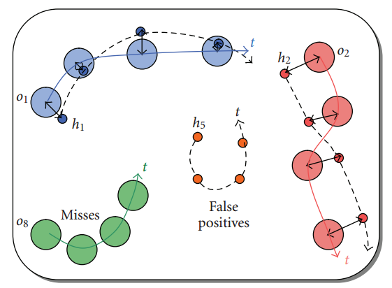
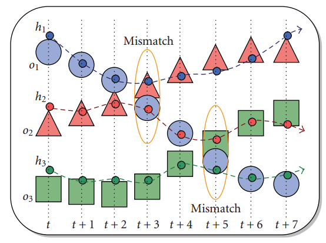
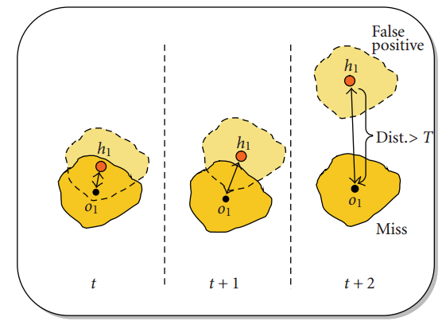
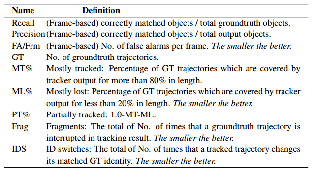

> Bernardin K, Stiefelhagen R. **Evaluating multiple object tracking performance: the CLEAR MOT metrics**[J]. EURASIP Journal on Image and Video Processing, 2008, 2008(1): 246309.

​      Assuming that for every time frame t, a multiple object tracker outputs a set of **hypotheses** $\{h_1,... ,h_m\}$ for a set of **visible objects (ground truth)** $\{o_1,... ,o_n\}$ 

+ count all objects for which no hypothesis was output as **misses (false negatives)** 
+ count all tracker hypotheses for which no real object exists as **false positives**

+ count all occurrences where the tracking hypothesis for an object changed compared to previous frames as mismatch errors.  
  + when two or more objects are swapped as they pass close to each other
  + when an object track is reinitialized with a different track ID, after it was previously lost because of occlusion

+ distance $dist_{i,j}$ of object $o_i$ and a hypothesis $h_j$ should not be made if  it exceeds a certain threshold $T$, but should rather argue that the tracker has missed the object and is tracking something else. 

### The multiple object tracking precision (MOTP)

+ It is the total error in estimated position for **matched object-hypothesis pairs over all frames**, averaged by the total number of matches made.

$$
MOTP = \frac{\sum_{i, t} d_t^i}{\sum_{t}c_t}
$$

+ It shows the ability of the tracker to estimate precise object positions.

### The multiple object tracking accuracy (MOTA) 

$$
MOTA = 1 - \frac{\sum_t (m_t + fp_t + mme_t)}{\sum_tg_t}
$$

+ $m_t$, $fp_t$, and $mme_t$ are the number of **misses**, of **false positives**, and of **mismatches**, respectively, for time frame t, computed over the total number of objects present in all frames.
+ The MOTA can be seen as derived from 3 error ratios: the ratio of misses in the sequence, the ratio of false positives, the ratio of mismatches.

> Li Y, Huang C, Nevatia R. **Learning to associate: Hybridboosted multi-target tracker for crowded scene**[C]//Computer Vision and Pattern Recognition, 2009. CVPR 2009. IEEE Conference on. IEEE, 2009: 2953-2960.

### ID Switch and Fragment

